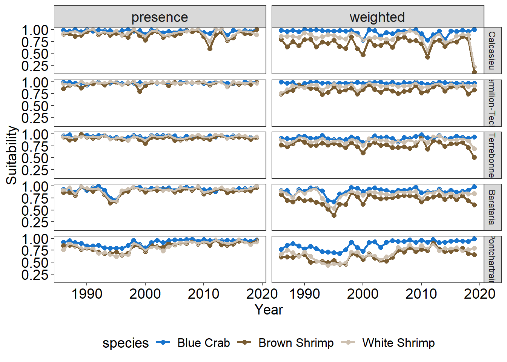

## Research question 
How does the stability of environmental regimes influence the habitat suitability of salt marsh species?


::: {.cell}

```{.r .cell-code}
# load libraries
library(tidyverse)
## ── Attaching core tidyverse packages ──────────────────────── tidyverse 2.0.0 ──
## ✔ dplyr     1.1.4     ✔ readr     2.1.5
## ✔ forcats   1.0.0     ✔ stringr   1.5.1
## ✔ ggplot2   3.5.1     ✔ tibble    3.2.1
## ✔ lubridate 1.9.3     ✔ tidyr     1.3.1
## ✔ purrr     1.0.2     
## ── Conflicts ────────────────────────────────────────── tidyverse_conflicts() ──
## ✖ dplyr::filter() masks stats::filter()
## ✖ dplyr::lag()    masks stats::lag()
## ℹ Use the conflicted package (<http://conflicted.r-lib.org/>) to force all conflicts to become errors
library(hypervolume)
## Loading required package: Rcpp

# load sav monitoring data 
df = read_csv('data/LDWFseinedata.csv') 
## Rows: 209451 Columns: 11
## ── Column specification ────────────────────────────────────────────────────────
## Delimiter: ","
## chr (3): basin, sci_name, species
## dbl (8): lat, lon, date, Salinity, WaterTemp, Turbidity, AirTemp, num
## 
## ℹ Use `spec()` to retrieve the full column specification for this data.
## ℹ Specify the column types or set `show_col_types = FALSE` to quiet this message.
head(df)
## # A tibble: 6 × 11
##     lat   lon   date Salinity WaterTemp Turbidity AirTemp basin sci_name species
##   <dbl> <dbl>  <dbl>    <dbl>     <dbl>     <dbl>   <dbl> <chr> <chr>    <chr>  
## 1  29.1 -90.9 1.99e7     20.8      9.20         2      13 Terr… Calline… Blue C…
## 2  29.1 -90.9 1.99e7     20.8      9.20         2      13 Terr… Micropo… Atlant…
## 3  29.1 -90.9 1.99e7     20.8      9.20         2      13 Terr… Palaemo… Grass …
## 4  29.1 -90.9 1.99e7     20.8      9.20         2      13 Terr… Membras… Rough …
## 5  29.1 -90.9 1.99e7     20.8      9.20         2      13 Terr… Fundulu… Longno…
## 6  29.1 -90.9 1.99e7     20.8      9.20         2      13 Terr… Sciaeno… Red Dr…
## # ℹ 1 more variable: num <dbl>
```
:::


## Manuscript assignment
1. Define the environmental regime and its stability for a region (one per student)
 - What is the environmental regime stability relative to the baseline using temperature, turbidity, and salinity as axes of your assigned basing?\
 


::: {.cell}

```{.r .cell-code}
# one observation per seine
df_e = read_csv('data/LDWFseinedata.csv') |> 
  filter(basin %in% c("Terrebonne","Pontchartrain", "Barataria",
                      "Calcasieu","Vermilion-Teche")) |> 
  distinct(lat, lon, date, basin, Salinity, WaterTemp, Turbidity) |> 
  mutate(date = ymd(date),
         year = year(date),
         across(c(Salinity:Turbidity), scale)) |> 
  select(basin, Salinity:year) |> 
  group_by(basin, year) |> 
  nest() |> 
  mutate(hv = map(data, \(data) hypervolume_gaussian(data, name = paste(basin, year,sep = '_'),
                                                     samples.per.point = 500,
                                                     kde.bandwidth = estimate_bandwidth(data), 
                                                     sd.count = 3, 
                                                     quantile.requested = 0.95, 
                                                     quantile.requested.type = "probability", 
                                                     chunk.size = 1000, 
                                                     verbose = F)),
         centroid = map(hv, \(hv) get_centroid(hv)),
         size = map_dbl(hv, \(hv) get_volume(hv)))

```
:::

::: {.cell}

:::

::: {.cell}

```{.r .cell-code}
# comparison of across each year
df_y= tibble(y1 = unique(df_e$year),
             y2 = unique(df_e$year)) |> 
  expand(y1,y2)

# make all unique year comparisons 
df_y = df_y[!duplicated(t(apply(df_y,1,sort))),] %>% 
  filter(!(y1 == y2))

# make two df to join all unique comparisons  
df1 = df_e |> 
  select(basin, y1 = year, hv1 = hv, hv1_size = size, cent1 = centroid)

df2 = df_e |> 
  select(basin, y2 = year, hv2 = hv, hv2_size = size, cent2 = centroid)


# create data frame of all data and make yearly comparisons
df_ov = tibble(basin = rep(unique(df$basin),
                           each = nrow(df_y)),
               y1 = rep(df_y$y1, times = length(unique(df_e$basin))),
               y2 = rep(df_y$y2, times = length(unique(df_e$basin)))) |> 
  inner_join(df1, by = c('basin', 'y1')) |> 
  inner_join(df2, by = c('basin', 'y2')) |> 
  mutate(ychange = y2-y1,
  # calculate the differnces in size 
         lsr = log(hv2_size/hv1_size),
  # join hypervolumees in a set for cverlap
         set = map2(hv1,hv2, \(hv1, hv2) hypervolume_set(hv1, hv2, check.memory = F, verbose = F)),
  # calculate overlap
         ov = map(set, \(set) hypervolume_overlap_statistics(set)),
  # calculate centroid distance 
         dist_cent = map2_dbl(hv1, hv2, \(hv1,hv2) hypervolume_distance(hv1, hv2, type = 'centroid', check.memory=F))) |> 
  #unnest centroid differences
  unnest_wider(ov) |> 
  # select only metrics of interest
  select(basin, y1, y2, ychange,lsr,
         dist_cent, jaccard, sorensen,
         uniq_y1 = frac_unique_1, uniq_y2 = frac_unique_2)

# save output
write_csv(df_ov, 'data/env_hvComp.csv')

```
:::


## Compare to baseline


::: {.cell}

```
## Rows: 2805 Columns: 10
## ── Column specification ────────────────────────────────────────────────────────
## Delimiter: ","
## chr (1): basin
## dbl (9): y1, y2, ychange, lsr, dist_cent, jaccard, sorensen, uniq_y1, uniq_y2
## 
## ℹ Use `spec()` to retrieve the full column specification for this data.
## ℹ Specify the column types or set `show_col_types = FALSE` to quiet this message.
```
:::

::: {.cell}

```{.r .cell-code}
# filter only single year comparisons
d = df_ov |> 
  filter(y1 == 1986)

# overlap
ggplot(d, aes(y2, sorensen, color = basin))+
  geom_point(size = 2)+
  geom_line(linewidth = 1)+
  labs(x = 'Year', y = 'Overlap')+
  scale_fill_viridis_d(option = 'turbo')+
  scale_color_viridis_d(option = 'turbo')+
  theme_bw()+
  facet_wrap(~basin, nrow = 2)+
  theme(axis.title = element_text(size = 14), 
        axis.text = element_text(size = 14, colour = "gray0"), 
        plot.title = element_text(size = 14, hjust=0.5),
        panel.grid.major = element_blank(),
        panel.grid.minor = element_blank(),
        legend.position = 'none',
        legend.title = element_text(size = 14),
        strip.text.x = element_text(size = 14),
        legend.text = element_text(size = 12))
```

::: {.cell-output-display}
{width=672}
:::

```{.r .cell-code}

# centroid distance 
ggplot(d, aes(y2, dist_cent, color = basin))+
  geom_hline(aes(yintercept = 1), linetype = 'dashed', linewidth = 1)+
  geom_point(size = 2)+
  geom_line(linewidth = 1)+
  labs(x = 'Year', y = 'Centroid distance')+
  scale_fill_viridis_d(option = 'turbo')+
  scale_color_viridis_d(option = 'turbo')+
  theme_bw()+
  facet_wrap(~basin, nrow = 2)+
  theme(axis.title = element_text(size = 14), 
        axis.text = element_text(size = 14, colour = "gray0"), 
        plot.title = element_text(size = 14, hjust=0.5),
        panel.grid.major = element_blank(),
        panel.grid.minor = element_blank(),
        legend.position = 'none',
        legend.title = element_text(size = 14),
        strip.text.x = element_text(size = 14),
        legend.text = element_text(size = 12))
```

::: {.cell-output-display}
{width=672}
:::

```{.r .cell-code}


# log size ratio
ggplot(d, aes(y2, lsr, color = basin))+
  geom_hline(aes(yintercept = 0), linetype = 'dashed', linewidth = 1)+
  geom_point(size = 2)+
  geom_line(linewidth = 1)+
  labs(x = 'Year', y = 'log(y2 size/y1 size)')+
  scale_fill_viridis_d(option = 'turbo')+
  scale_color_viridis_d(option = 'turbo')+
  theme_bw()+
  facet_wrap(~basin, nrow = 2)+
  theme(axis.title = element_text(size = 14), 
        axis.text = element_text(size = 14, colour = "gray0"), 
        plot.title = element_text(size = 14, hjust=0.5),
        panel.grid.major = element_blank(),
        panel.grid.minor = element_blank(),
        legend.position = 'none',
        legend.title = element_text(size = 14),
        strip.text.x = element_text(size = 14),
        legend.text = element_text(size = 12))
```

::: {.cell-output-display}
{width=672}
:::
:::


## all comparisons without time


::: {.cell}

```{.r .cell-code}
df_ov = read_csv('data/env_hvComp.csv') |> 
  mutate(basin = factor(basin, levels = 
                          c("Calcasieu", "Vermilion-Teche", "Terrebonne",
                            "Barataria", "Pontchartrain")))
## Rows: 2805 Columns: 10
## ── Column specification ────────────────────────────────────────────────────────
## Delimiter: ","
## chr (1): basin
## dbl (9): y1, y2, ychange, lsr, dist_cent, jaccard, sorensen, uniq_y1, uniq_y2
## 
## ℹ Use `spec()` to retrieve the full column specification for this data.
## ℹ Specify the column types or set `show_col_types = FALSE` to quiet this message.
#overlap
ggplot(df_ov, aes(basin, sorensen, fill = basin))+
  geom_point(aes(color = basin), size = 1, 
             position=position_jitterdodge(dodge.width = 0.75, jitter.width = 1))+
  # geom_errorbar(aes(ymin = lc, ymax = uc), linewidth = 2, width = 0)+
  geom_boxplot(alpha = 0.6, outliers = F)+
  labs(x = 'Basin', y = 'Overlap')+
  scale_fill_viridis_d(option = 'turbo')+
  scale_color_viridis_d(option = 'turbo')+
  theme_bw()+
  theme(axis.title = element_text(size = 14), 
        axis.text = element_text(size = 14, colour = "gray0"), 
        plot.title = element_text(size = 14, hjust=0.5),
        panel.grid.major = element_blank(),
        panel.grid.minor = element_blank(),
        legend.position = 'none',
        legend.title = element_text(size = 14),
        strip.text.x = element_text(size = 14),
        legend.text = element_text(size = 12))
```

::: {.cell-output-display}
{width=672}
:::

```{.r .cell-code}

# centroid distance
ggplot(df_ov, aes(basin, dist_cent, fill = basin))+
  geom_hline(aes(yintercept = 1), linetype = 'dashed', linewidth = 1)+
  geom_point(aes(color = basin), size = 1, 
             position=position_jitterdodge(dodge.width = 0.75, jitter.width = 1))+
  # geom_errorbar(aes(ymin = lc, ymax = uc), linewidth = 2, width = 0)+
  geom_boxplot(alpha = 0.6, outliers = F)+
  labs(x = 'Basin', y = 'Centroid distance')+
  scale_fill_viridis_d(option = 'turbo')+
  scale_color_viridis_d(option = 'turbo')+
  theme_bw()+
  theme(axis.title = element_text(size = 14), 
        axis.text = element_text(size = 14, colour = "gray0"), 
        plot.title = element_text(size = 14, hjust=0.5),
        panel.grid.major = element_blank(),
        panel.grid.minor = element_blank(),
        legend.position = 'none',
        legend.title = element_text(size = 14),
        strip.text.x = element_text(size = 14),
        legend.text = element_text(size = 12))
```

::: {.cell-output-display}
{width=672}
:::

```{.r .cell-code}


# log size ratio
ggplot(df_ov, aes(basin, lsr, fill = basin))+
  geom_hline(aes(yintercept = 0), linetype = 'dashed', linewidth = 1)+
  geom_point(aes(color = basin), size = 1, 
             position=position_jitterdodge(dodge.width = 0.75, jitter.width = 1))+
  # geom_errorbar(aes(ymin = lc, ymax = uc), linewidth = 2, width = 0)+
  geom_boxplot(alpha = 0.6, outliers = F)+
  labs(x = 'Basin', y = 'log(y2 size/y1 size)')+
  scale_fill_viridis_d(option = 'turbo')+
  scale_color_viridis_d(option = 'turbo')+
  theme_bw()+
  theme(axis.title = element_text(size = 14), 
        axis.text = element_text(size = 14, colour = "gray0"), 
        plot.title = element_text(size = 14, hjust=0.5),
        panel.grid.major = element_blank(),
        panel.grid.minor = element_blank(),
        legend.position = 'none',
        legend.title = element_text(size = 14),
        strip.text.x = element_text(size = 14),
        legend.text = element_text(size = 12))
```

::: {.cell-output-display}
{width=672}
:::
:::


## Year to Year comparisons


::: {.cell}

```{.r .cell-code}
# filter only single year comparisons
d = df_ov |> 
  filter(ychange == 1)

# overlap
ggplot(d, aes(y2, sorensen, color = basin))+
  geom_point(size = 2)+
  geom_line(linewidth = 1)+
  labs(x = 'Year', y = 'Overlap')+
  scale_fill_viridis_d(option = 'turbo')+
  scale_color_viridis_d(option = 'turbo')+
  theme_bw()+
  facet_wrap(~basin, nrow = 2)+
  theme(axis.title = element_text(size = 14), 
        axis.text = element_text(size = 14, colour = "gray0"), 
        plot.title = element_text(size = 14, hjust=0.5),
        panel.grid.major = element_blank(),
        panel.grid.minor = element_blank(),
        legend.position = 'none',
        legend.title = element_text(size = 14),
        strip.text.x = element_text(size = 14),
        legend.text = element_text(size = 12))
```

::: {.cell-output-display}
{width=672}
:::

```{.r .cell-code}

# centroid distance 
ggplot(d, aes(y2, dist_cent, color = basin))+
  geom_hline(aes(yintercept = 1), linetype = 'dashed', linewidth = 1)+
  geom_point(size = 2)+
  geom_line(linewidth = 1)+
  labs(x = 'Year', y = 'Centroid distance')+
  scale_fill_viridis_d(option = 'turbo')+
  scale_color_viridis_d(option = 'turbo')+
  theme_bw()+
  facet_wrap(~basin, nrow = 2)+
  theme(axis.title = element_text(size = 14), 
        axis.text = element_text(size = 14, colour = "gray0"), 
        plot.title = element_text(size = 14, hjust=0.5),
        panel.grid.major = element_blank(),
        panel.grid.minor = element_blank(),
        legend.position = 'none',
        legend.title = element_text(size = 14),
        strip.text.x = element_text(size = 14),
        legend.text = element_text(size = 12))
```

::: {.cell-output-display}
{width=672}
:::

```{.r .cell-code}

# log size ratio
ggplot(d, aes(y2, lsr, color = basin))+
  geom_hline(aes(yintercept = 0), linetype = 'dashed', linewidth = 1)+
  geom_point(size = 2)+
  geom_line(linewidth = 1)+
  labs(x = 'Year', y = 'log(y2 size/y1 size)')+
  scale_fill_viridis_d(option = 'turbo')+
  scale_color_viridis_d(option = 'turbo')+
  theme_bw()+
  facet_wrap(~basin, nrow = 2)+
  theme(axis.title = element_text(size = 14), 
        axis.text = element_text(size = 14, colour = "gray0"), 
        plot.title = element_text(size = 14, hjust=0.5),
        panel.grid.major = element_blank(),
        panel.grid.minor = element_blank(),
        legend.position = 'none',
        legend.title = element_text(size = 14),
        strip.text.x = element_text(size = 14),
        legend.text = element_text(size = 12))
```

::: {.cell-output-display}
{width=672}
:::
:::


## Trend in stability 


::: {.cell}

```{.r .cell-code}
library(MuMIn)
# overlap 
df_o = df_ov |> 
  group_by(basin) |>
  nest() |> 
  # fit intercept, linear, and quadratic model
  mutate(m_int = map(data, \(df)lm(sorensen~1, data = df)),
         m_lin = map(data, \(df)lm(sorensen~ychange, data = df)),
         m_quad = map(data, \(df)lm(sorensen~ychange + I(ychange^2), data = df)),
         AICc_int = map_dbl(m_int, \(x) AICc(x)),
         AICc_lin = map_dbl(m_lin, \(x) AICc(x)),
         AICc_quad = map_dbl(m_quad, \(x) AICc(x)),
         model = case_when(
           AICc_int - min(c(AICc_int,AICc_lin,AICc_quad)) <= 4 ~ 'Intercept',
           AICc_lin - AICc_quad <= 4 ~ 'Linear',
           T ~ 'Quadratic'))

# unnest data 
d = df_o |> 
  select(basin, data, model) |> 
  unnest(cols = c(data)) |>  
  mutate(basin = factor(basin, levels = 
                          c("Calcasieu", "Vermilion-Teche", "Terrebonne",
                            "Barataria", "Pontchartrain")))

ggplot(d, aes(ychange, sorensen, color = basin))+
  geom_point(size = 2.5)+
  geom_smooth(data = d |> filter(model == 'Intercept'),
              method = 'lm', formula = y~1, 
              linewidth = 1, color = 'black')+
  geom_smooth(data = d |> filter(model == 'Linear'),
              method = 'lm', formula = y~x, 
              linewidth = 1, color = 'black')+
  geom_smooth(data = d |> filter(model == 'Quadratic'),
              method = 'lm', formula = y~x+I(x^2), 
              linewidth = 1, color = 'black')+
  facet_wrap(~basin,  nrow = 2)+
  labs(x = 'Years between comparison', y = 'Overlap')+
  scale_color_viridis_d(option = 'turbo')+
  theme_bw()+
  theme(axis.title = element_text(size = 14), 
        axis.text.y = element_text(size = 14, colour = "black"),
        axis.text.x = element_text(size = 12, colour = "black"), 
        plot.title = element_text(size = 14, hjust=0.5),
        panel.grid.major = element_blank(),
        panel.grid.minor = element_blank(),
        legend.position = 'none',
        legend.title = element_text(size = 14),
        strip.text.x = element_text(size = 14),
        legend.text = element_text(size = 12))
```

::: {.cell-output-display}
{width=672}
:::

```{.r .cell-code}

# centroid distance
df_cd = df_ov |> 
  group_by(basin) |>
  nest() |> 
  # fit intercept, linear, and quadratic model
  mutate(m_int = map(data, \(df)lm(dist_cent~1, data = df)),
         m_lin = map(data, \(df)lm(dist_cent~ychange, data = df)),
         m_quad = map(data, \(df)lm(dist_cent~ychange + I(ychange^2), data = df)),
         AICc_int = map_dbl(m_int, \(x) AICc(x)),
         AICc_lin = map_dbl(m_lin, \(x) AICc(x)),
         AICc_quad = map_dbl(m_quad, \(x) AICc(x)),
         model = case_when(
           AICc_int - min(c(AICc_int,AICc_lin,AICc_quad)) <= 4 ~ 'Intercept',
           AICc_lin - AICc_quad <= 4 ~ 'Linear',
           T ~ 'Quadratic'))

# unnest data 
d = df_cd |> 
  select(basin, data, model) |> 
  unnest(cols = c(data)) |>  
  mutate(basin = factor(basin, levels = 
                          c("Calcasieu", "Vermilion-Teche", "Terrebonne",
                            "Barataria", "Pontchartrain")))

ggplot(d, aes(ychange, dist_cent, color = basin))+
  geom_hline(aes(yintercept = 1), linetype = 'dashed')+
  geom_point(size = 2.5)+
  geom_smooth(data = d |> filter(model == 'Intercept'),
              method = 'lm', formula = y~1, 
              linewidth = 1, color = 'black')+
  geom_smooth(data = d |> filter(model == 'Linear'),
              method = 'lm', formula = y~x, 
              linewidth = 1, color = 'black')+
  geom_smooth(data = d |> filter(model == 'Quadratic'),
              method = 'lm', formula = y~x+I(x^2), 
              linewidth = 1, color = 'black')+
  facet_wrap(~basin,  nrow = 2)+
  labs(x = 'Years between comparison', y = 'Centroid distance')+
  scale_color_viridis_d(option = 'turbo')+
  theme_bw()+
  theme(axis.title = element_text(size = 14), 
        axis.text.y = element_text(size = 14, colour = "black"),
        axis.text.x = element_text(size = 12, colour = "black"), 
        plot.title = element_text(size = 14, hjust=0.5),
        panel.grid.major = element_blank(),
        panel.grid.minor = element_blank(),
        legend.position = 'none',
        legend.title = element_text(size = 14),
        strip.text.x = element_text(size = 14),
        legend.text = element_text(size = 12))
```

::: {.cell-output-display}
{width=672}
:::

```{.r .cell-code}

# log size ratio
df_lsr = df_ov |> 
  group_by(basin) |>
  nest() |> 
  # fit intercept, linear, and quadratic model
  mutate(m_int = map(data, \(df)lm(lsr~1, data = df)),
         m_lin = map(data, \(df)lm(lsr~ychange, data = df)),
         m_quad = map(data, \(df)lm(lsr~ychange + I(ychange^2), data = df)),
         AICc_int = map_dbl(m_int, \(x) AICc(x)),
         AICc_lin = map_dbl(m_lin, \(x) AICc(x)),
         AICc_quad = map_dbl(m_quad, \(x) AICc(x)),
         model = case_when(
           AICc_int - min(c(AICc_int,AICc_lin,AICc_quad)) <= 4 ~ 'Intercept',
           AICc_lin - AICc_quad <= 4 ~ 'Linear',
           T ~ 'Quadratic'))

# unnest data 
d = df_lsr |> 
  select(basin, data, model) |> 
  unnest(cols = c(data)) |>  
  mutate(basin = factor(basin, levels = 
                          c("Calcasieu", "Vermilion-Teche", "Terrebonne",
                            "Barataria", "Pontchartrain")))

ggplot(d, aes(ychange, lsr, color = basin))+
  geom_hline(aes(yintercept = 0), linetype = 'dashed')+
  geom_point(size = 2.5)+
  geom_smooth(data = d |> filter(model == 'Intercept'),
              method = 'lm', formula = y~1, 
              linewidth = 1, color = 'black')+
  geom_smooth(data = d |> filter(model == 'Linear'),
              method = 'lm', formula = y~x, 
              linewidth = 1, color = 'black')+
  geom_smooth(data = d |> filter(model == 'Quadratic'),
              method = 'lm', formula = y~x+I(x^2), 
              linewidth = 1, color = 'black')+
  facet_wrap(~basin,  nrow = 2)+
  labs(x = 'Years between comparison', y = 'log(y2 size/y1 size)')+
  scale_color_viridis_d(option = 'turbo')+
  theme_bw()+
  theme(axis.title = element_text(size = 14), 
        axis.text.y = element_text(size = 14, colour = "black"),
        axis.text.x = element_text(size = 12, colour = "black"), 
        plot.title = element_text(size = 14, hjust=0.5),
        panel.grid.major = element_blank(),
        panel.grid.minor = element_blank(),
        legend.position = 'none',
        legend.title = element_text(size = 14),
        strip.text.x = element_text(size = 14),
        legend.text = element_text(size = 12))
```

::: {.cell-output-display}
{width=672}
:::
:::


2. Characterize the environmental niche of three species (white shrimp and 2 of your preference)


::: {.cell}

```{.r .cell-code}
df_sp = read_csv('data/LDWFseinedata.csv') |> 
  filter(basin %in% c("Terrebonne","Pontchartrain", "Barataria",
                      "Calcasieu","Vermilion-Teche"),
         species %in% c('Blue Crab', 'White Shrimp', 'Brown Shrimp')) |> 
  select(lat:date, basin:num) |> 
    mutate(date = ymd(date),
         year = year(date))


df_e = read_csv('data/LDWFseinedata.csv') |> 
  filter(basin %in% c("Terrebonne","Pontchartrain", "Barataria",
                      "Calcasieu","Vermilion-Teche")) |> 
  distinct(lat, lon, date, basin, Salinity, WaterTemp, Turbidity) |> 
  mutate(date = ymd(date),
         year = year(date),
         across(c(Salinity:Turbidity), scale))

df = df_sp |> 
  left_join(df_e) |> 
  select(species, num, Salinity:Turbidity) |> 
  nest(.by = 'species', weight = num, data = Salinity:Turbidity) |> 
  mutate(presence = map(data, \(data) hypervolume_gaussian(data, 
                                                     name = paste0(species, '_presence'),,
                                                     samples.per.point = ceiling((10^(3 + sqrt(ncol(data))))/nrow(data)),
                                                     kde.bandwidth = estimate_bandwidth(data), 
                                                     sd.count = 3, 
                                                     quantile.requested = 0.95, 
                                                     quantile.requested.type = "probability", 
                                                     chunk.size = 1000, 
                                                     verbose = F)),
         weighted = map2(data,weight, \(data,weight) 
                         hypervolume_gaussian(data,
                                              name = paste0(species, '_weighted'),
                                              weight = weight$num,
                                              samples.per.point = ceiling((10^(3 + sqrt(ncol(data))))/nrow(data)),
                                              kde.bandwidth = estimate_bandwidth(data), 
                                              sd.count = 3, 
                                              quantile.requested = 0.95, 
                                              quantile.requested.type = "probability", 
                                              chunk.size = 1000, 
                                              verbose = F))) |> 
  pivot_longer(presence:weighted, names_to = 'type', values_to = 'hv') |> 
  mutate(centroid = map(hv, \(hv) get_centroid(hv)),
         size = map_dbl(hv, \(hv) get_volume(hv)))
                                                                    

saveRDS(df, 'data/spp_hvs.rds')
```
:::

::: {.cell}

:::


species comparisons


::: {.cell}

```{.r .cell-code}
# comparison of across each year
df_spp= tibble(sp1 = unique(df$species),
             sp2 = unique(df$species)) |> 
  expand(sp1,sp2)

# make all unique species comparisons 
df_spp = df_spp[!duplicated(t(apply(df_spp,1,sort))),] %>% 
  filter(!(sp1 == sp2))

# make two df to join all unique comparisons  
df1 = df |> 
  select(type, sp1 = species, hv1 = hv, hv1_size = size, cent1 = centroid)

df2 = df |> 
  select(type, sp2 = species, hv2 = hv, hv2_size = size, cent2 = centroid)


# create data frame of all data and make speciesly comparisons
df_ov = tibble(type = rep(unique(df$type),
                           each = nrow(df_spp)),
               sp1 = rep(df_spp$sp1, times = length(unique(df$type))),
               sp2 = rep(df_spp$sp2, times = length(unique(df$type)))) |> 
  inner_join(df1, by = c('type', 'sp1')) |> 
  inner_join(df2, by = c('type', 'sp2')) |> 
  mutate(
  # join hypervolumees in a set for cverlap
         set = map2(hv1,hv2, \(hv1, hv2) hypervolume_set(hv1, hv2, check.memory = F, verbose = F)),
  # calculate overlap
         ov = map(set, \(set) hypervolume_overlap_statistics(set)),
  # calculate centroid distance 
         dist_cent = map2_dbl(hv1, hv2, \(hv1,hv2) hypervolume_distance(hv1, hv2, type = 'centroid', check.memory=F))) |> 
  #unnest centroid differences
  unnest_wider(ov) |> 
  # select only metrics of interest
  select(type, sp1, sp2,
         dist_cent, jaccard, sorensen,
         uniq_sp1 = frac_unique_1, uniq_sp2 = frac_unique_2)

# save output
write_csv(df_ov, 'data/spp_comp.csv')

```
:::

::: {.cell}

```
## Rows: 6 Columns: 8
## ── Column specification ────────────────────────────────────────────────────────
## Delimiter: ","
## chr (3): type, sp1, sp2
## dbl (5): dist_cent, jaccard, sorensen, uniq_sp1, uniq_sp2
## 
## ℹ Use `spec()` to retrieve the full column specification for this data.
## ℹ Specify the column types or set `show_col_types = FALSE` to quiet this message.
## # A tibble: 6 × 8
##   type     sp1          sp2         dist_cent jaccard sorensen uniq_sp1 uniq_sp2
##   <chr>    <chr>        <chr>           <dbl>   <dbl>    <dbl>    <dbl>    <dbl>
## 1 presence Blue Crab    Brown Shri…     0.378   0.704    0.826   0.281    0.0295
## 2 presence Blue Crab    White Shri…     0.356   0.761    0.865   0.213    0.0414
## 3 presence Brown Shrimp White Shri…     0.177   0.841    0.914   0.0364   0.131 
## 4 weighted Blue Crab    Brown Shri…     0.736   0.500    0.666   0.485    0.0572
## 5 weighted Blue Crab    White Shri…     0.676   0.564    0.721   0.390    0.119 
## 6 weighted Brown Shrimp White Shri…     0.482   0.681    0.810   0.0817   0.275
```
:::


 - What is the overall niche size of these three species?\
 - What is the degree of niche overlap among these species?\
 
3. Quantify habitat suitability changes for selected species
 - How the proportion of suitable sites for your species has changed over 40 years, especially in the basin assigned for you?\
 


::: {.cell}

```{.r .cell-code}
# environmental data
df_e = read_csv('data/LDWFseinedata.csv') |> 
  filter(basin %in% c("Terrebonne","Pontchartrain", "Barataria",
                      "Calcasieu","Vermilion-Teche")) |> 
  distinct(lat, lon, date, basin, Salinity, WaterTemp, Turbidity) |> 
  mutate(date = ymd(date),
         year = year(date),
         across(c(Salinity:Turbidity), scale)) |> 
  # slice_sample(n = 25) |> 
  nest(info = c(lat:basin, year), data = Salinity:Turbidity)

# species hypervolumes
df_hv = readRDS('data/spp_hvs.rds') |> 
  select(species, type, hv)


df = tibble(df_hv, df_e) |> 
  mutate(suitability = map2(hv, data, \(hv, data)
                            hypervolume_inclusion_test(hv, data))) |> 
  select(-hv) |> 
  unnest(c(info, data, suitability)) |> 
  group_by(species, type, lat, lon, basin, year) |> 
  summarize(suitability = mean(suitability))


write_csv(df, 'data/spp_suitability.csv')
```
:::

::: {.cell}

```
## Rows: 12360 Columns: 7
## ── Column specification ────────────────────────────────────────────────────────
## Delimiter: ","
## chr (3): species, type, basin
## dbl (4): lat, lon, year, suitability
## 
## ℹ Use `spec()` to retrieve the full column specification for this data.
## ℹ Specify the column types or set `show_col_types = FALSE` to quiet this message.
```
:::

::: {.cell}

```{.r .cell-code}
d = df |> 
  group_by(species, type, year, basin) |> 
  summarize(mean = mean(suitability),
            sd = sd(suitability),
            low = if_else(mean - sd > 0, mean - sd, 0),
            up = if_else(mean + sd < 1, mean + sd, 1)) |> 
    mutate(basin = factor(basin, levels = 
                          c("Calcasieu", "Vermilion-Teche", "Terrebonne",
                            "Barataria", "Pontchartrain")))
## `summarise()` has grouped output by 'species', 'type', 'year'. You can override
## using the `.groups` argument.


# plot
ggplot(d, aes(year, mean, color = species))+
  geom_pointrange(aes(ymin = low, ymax = up),
                  size = 0.5, linewidth = 1)+
  geom_line(linewidth = 1)+
  labs(x = 'Year', y = 'Suitability')+
  scale_color_manual(values = c('dodgerblue3', '#795C32', 'antiquewhite3'))+
  facet_grid(cols = vars(type), rows = vars(basin))+
  theme_bw()+
  theme(axis.title = element_text(size = 14), 
        axis.text = element_text(size = 14, colour = "black"), 
        plot.title = element_text(size = 14, hjust=0.5),
        panel.grid.major = element_blank(),
        panel.grid.minor = element_blank(),
        legend.position = 'bottom',
        legend.title = element_text(size = 14),
        strip.text.x = element_text(size = 14),
        legend.text = element_text(size = 12))
```

::: {.cell-output-display}
{width=672}
:::

```{.r .cell-code}


# plot
ggplot(d, aes(year, mean, color = species))+
  geom_point(size = 2)+
  geom_line(linewidth = 1)+
  labs(x = 'Year', y = 'Suitability')+
  scale_color_manual(values = c('dodgerblue3', '#795C32', 'antiquewhite3'))+
  facet_grid(cols = vars(type), rows = vars(basin))+
  theme_bw()+
  theme(axis.title = element_text(size = 14), 
        axis.text = element_text(size = 14, colour = "black"), 
        plot.title = element_text(size = 14, hjust=0.5),
        panel.grid.major = element_blank(),
        panel.grid.minor = element_blank(),
        legend.position = 'bottom',
        legend.title = element_text(size = 14),
        strip.text.x = element_text(size = 14),
        legend.text = element_text(size = 12))
```

::: {.cell-output-display}
{width=672}
:::
:::


 

### Basin assignments
Alia - Pontchartrain \
Carlos - Barataria \
Emily - Terrebonne \
Hannah-Marie - Vermilion-Teche \
Nico - Calcasieu \


### Data 
For this assignment we will be using the LDWF longterm data. 
[LDWF seine data](https://github.com/SeascapeEcologyLab-workshops/BSC6926-B53B_Spring2025/blob/main/data/LDWFseinedata.csv)


